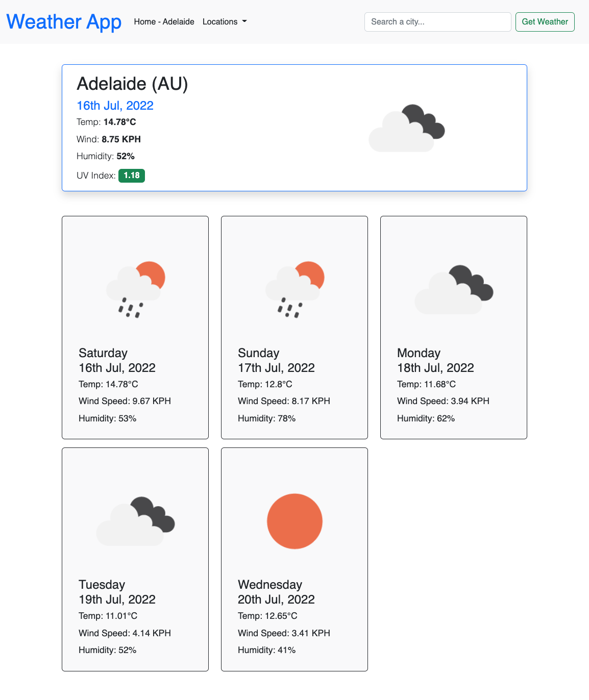

# Weather App

A simple application to get the weather in different cities.

As you lookup weather in different areas your searches persist in local storage and populate the 'Locations' drop-down list for re-use.

The Home Town feature allows you to set a location as your 'Home Town' for immediate access to it on the navigation bar.

[Github Repo](https://github.com/bradbrad88/weather-app)
[Deployed site](bradbrad88.github.io_weather-app_.png)

